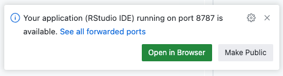
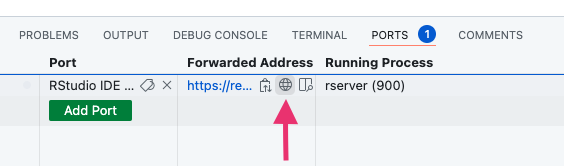

# devcontainer images for R

<!-- badges: start -->

[](https://www.repostatus.org/#wip)
[](https://github.com/Lin611-2024/devcontainer-images/actions/workflows/build.yml)

<!-- badges: end -->

This is a fork of the [rocker.org devcontainer-images repository](https://github.com/rocker-org/devcontainer-images).
It's configured to generate a devcontainer image to be used with Github codespaces.

The image is available at:

```
ghcr.io/lin611-2024/devcontainer/bayesdevcontainer:4
```

The base image is rocker-org/rstudio. In addition

- [cmdstan](https://mc-stan.org/users/interfaces/cmdstan) is installed, and the path to cmdstan is configured for [cmdstanr](https://mc-stan.org/cmdstanr/).
- [rstudio-prefs.json](src/rstudio/assets/rstudio-prefs.json) is set to default to `/workspaces` as the working directory.
- [.Rprofile](src/rstudio/assets/.Rprofile) has a hook defined to automatically open the working directory as a project.
- Additional R packages (with a focus on bayesian stats) listed in [.rpackages](src/rstudio/assets/.rpackages).

https://github.com/Lin611-2024/devcontainer-images/blob/b1dcb999fb1c07696a9e277a47f08cae7f81d656/src/rstudio/assets/.rpackages#L1

## Recommended usage

I'd recommend using a `.devcontainer/devcontainer.json` file like so:

```json
{
    "image": "ghcr.io/lin611-2024/devcontainer/bayesdevcontainer:4",
    "features": {
        "ghcr.io/rocker-org/devcontainer-features/rstudio-server": {
            "singleUser": true
        }
    },
    "postAttachCommand": {
        "github_user": "echo \"GITHUB_USER=$GITHUB_USER\">>~/.Renviron && echo \"GITHUB_TOKEN=$GITHUB_TOKEN\">>~/.Renviron",
        "project-rename": "mv *.Rproj $(basename $(pwd)).Rproj",
        "rstudio-start": "rserver"
    },
    "forwardPorts": [
        8787
    ],
    "portsAttributes": {
        "8787": {
            "label": "RStudio IDE"
        }
    }
}
```

This will

- Configure RStudio server for single user use (no login page)
- Add the codespaces' github credentials to the R environment (enabling pushing/pulling from the RStudio Git interface.)
- Rename the `.Rproj` file after the working directory
- Launch RStudio server.

Once the codespace has built and the post creation commands run, you can access RStudio one of two ways.

1. An info box will initially pop open telling uou that the application running on port 8787 is available.



2. Under the ports tab, you should also see port 8787 labelled RStudio IDE.


